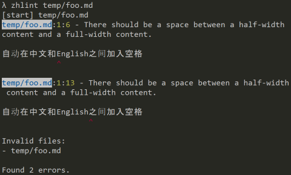

#  zhlint

一个中文内容的格式化工具。

## 如何安装

您可以通过 `npm` 或 `yarn` 安装 `zhlint`：

```bash
# 通过 npm 安装
npm install zhlint -g

# 或通过 yarn
yarn global add zhlint

# 或通过 pnpm
pnpm add zhlint -g
```

## 用法

### 作为 CLI

```bash
# Glob 文件，执行格式化命令，并打印错误报告，
# 如果有任何错误被发现，则会以错误码 `1` 退出。
zhlint <file-pattern>

# Glob 文件，并修复所有可能发现的错误。
zhlint <file-pattern> --fix

# 格式化文件并将修复后的内容输出到另一个文件。
zhlint <input-file-path> --output=<output-file-path>

# 打印用法信息
zhlint --help
```

错误报告看起来像这样：



### 作为 Node.js 包

```js
const { run, report } = require('zhlint')

const value = '自动在中文和English之间加入空格'
const options = { rules: { preset: 'default' }}
const output = run(value, options)

// 打印 '自动在中文和 English 之间加入空格'
console.log(output.result)

// 打印错误报告
report([output])
```

错误报告的格式像这样：

```bash
1:6 - 此处中英文内容之间需要一个空格

自动在中文和English之间加入空格
　　　　　　^

1:13 - 此处中英文内容之间需要一个空格

自动在中文和English之间加入空格
       　　　　　　^
Invalid files:
- foo.md

Found 2 errors.
```

### 作为一个单独的包

您可以找到一个 JavaScript 文件 `dist/zhlint.js` 作为独立版本。 例如，要使用它，您可以直接将它添加到您的浏览器中作为 `<script>` 标签。 即可访问全局变量 `zhlint`。


## API

- `run(str: string, options?: Options): Result`：格式化某个文件。
  - 参数：
    - `str`：需要格式化的文本内容。
    - `options`：一些配置选项。
  - 返回值：
    - 针对输入的单个字符串的处理结果。其包好了修复格式之后的文本内容 `value` 以及所有 `validation` 的校验信息。
- `report(results: Result[], logger?: Console): void`：为每个文件打印校验报告。
  - 参数：
    - `results`：所有格式化结果的数组。
    - `logger`：日志处理器实例，默认是 Node.js/浏览器中的 `console`。

### 选项

自定义你的格式化规则和其它高阶选项。

```ts
type Options = {
  rules?: RuleOptions
  hyperParse?: string[]
  ignoredCases?: IgnoredCase[]
  logger?: Console
}
```

- `rules`：自定义格式化规则，可以是 `undefined` 意味着不做任何格式化，也可以是 `{ preset: 'default' }` 以使用默认配置。关于 `RuleOptions` 的更多细节参见[支持的规则](#支持的规则)。
- `hyperParse`：根据解析器名自定义超文本解析器列表。可以是 `undefined` 以使用默认的[忽略特例的解析器](https://github.com/Jinjiang/zhlint/tree/master/src/hypers/ignore.js)、[Markdown 解析器](https://github.com/Jinjiang/zhlint/tree/master/src/hypers/md.js)以及[Hexo tag 解析器](https://github.com/Jinjiang/zhlint/tree/master/src/hypers/hexo.js)。
- `ignoredCases`：提供想要忽略的特例。
  - `IgnoredCase`：`{ prefix?, textStart, textEnd?, suffix? }`
    - 遵循该特定的格式，灵感来自 [W3C Scroll To Text Fragment Proposal](https://github.com/WICG/ScrollToTextFragment)。
- `logger`：和 `report(...)` 中的参数相同。

### 输出格式

```ts
type Result = {
  file?: string
  origin: string
  result: string
  validations: Validation[]
}

type Validation = {
  index: number
  length: number
  message: string
}
```

- `Result`
  - `file`：文件名。这是一个可选的字段，只在 CLI 中适用。
  - `origin`：原始的文本内容。
  - `result`：最终修复格式的文本内容。
  - `validations`：所有校验信息。
- `Validation`
  - `index`：输入的字符串中目标片段所在的索引值。
  - `length`：输入的字符串中目标片段的长度。
  - `message`：对该校验信息的自然语言描述。

## 特性

### Markdown 语法支持

```js
run('自动在_中文_和**English**之间加入空格')
```

### [Hexo tag](https://hexo.io/docs/tag-plugins) 语法支持

```js
run('现在过滤器只能用在插入文本中 (`{{ }}` tags)。')
```

### 设置被忽略的特例

通过 HTML 注释：

```md
<!-- the good case -->

text before (text inside) text after

<!-- the bad case -->

vm.$on( event, callback )

<!-- 我们可以在这里写下要忽略的特例 -->
<!-- zhlint ignore: ( , ) -->
```

或传入高阶选项：

```js
run(str, { ignoredCases: { textStart: '( ', textEnd: ' )' } })
```

## 支持的预处理器 (超文本解析器)

- `ignore`：通过 HTML 注释 `<!-- zhlint ignore: ... -->` 匹配所有被忽略的特例
- `hexo`：匹配所有 Hexo tag 以避免它们被解析。
- `markdown`：用 Markdown 解析器找到所有的块级文本和内联级的标记。

## 支持的规则

_大多数规则都提炼自过往 [W3C 中文排版需求](https://www.w3.org/International/clreq/)、[W3C HTML 中文兴趣组](https://www.w3.org/html/ig/zh/wiki/Main_Page)和 [Vue.js 中文文档](https://github.com/vuejs/cn.vuejs.org/wiki)的翻译经验。_

_……这些规则也许存在争议。所以如果你对某些规则不够满意，我们非常希望得到大家的反馈和改进建议。我们也一直欢迎大家来创建 [issue](https://github.com/jinjiang/zhlint/issues)，以讨论出可能更好的规则。_

```ts
type RuleOptions = {
  /* PRESET */

  // Custom preset, currently only support:
  // - `'default'`
  preset?: string

  /* PUNCTUATIONS */

  // Convert these punctuations into halfwidth.
  // default preset: `()`
  // e.g. `（文字）` -> `(文字)`
  halfwidthPunctuation?: string

  // Convert these punctuations into fullwidth.
  // default preset: `，。：；？！“”‘’`
  // e.g. `文字,文字.` -> `文字，文字。`
  fullwidthPunctuation?: string

  // Treat these fullwidth punctuations as half-fullWidthPunctuation
  // when processing the spaces issues around them.
  // Since something like quotations in morder Chinese fonts are
  // only rendered in halfwidth.
  // default preset: `“”‘’`
  adjustedFullwidthPunctuation?: string

  // Convert traditional Chinese punctuations into simplified ones or vice versa.
  // default preset: `simplified`
  // e.g. `「文字」` -> `“文字”`
  //
  // besides the above, we also unify some common punctuations below:
  //
  // // U+2047 DOUBLE QUESTION MARK, U+203C DOUBLE EXCLAMATION MARK
  // // U+2048 QUESTION EXCLAMATION MARK, U+2049 EXCLAMATION QUESTION MARK
  // '？？': ['⁇'],
  // '！！': ['‼'],
  // '？！': ['⁈'],
  // '！？': ['⁉'],
  //
  // // U+002F SOLIDUS, U+FF0F FULLWIDTH SOLIDUS
  // '/': ['/', '／'],
  //
  // // U+FF5E FULLWIDTH TILDE
  // '~': ['~', '～'],
  //
  // // U+2026 HORIZONTAL ELLIPSIS, U+22EF MIDLINE HORIZONTAL ELLIPSIS
  // '…': ['…', '⋯'],
  //
  // // U+25CF BLACK CIRCLE, U+2022 BULLET, U+00B7 MIDDLE DOT,
  // // U+2027 HYPHENATION POINT, U+30FB KATAKANA MIDDLE DOT
  // '·': ['●', '•', '·', '‧', '・'],
  //
  // advanced usage: you can also specify a more detailed map like:
  //
  // ```
  // {
  //   default: true, // follow all the default preset
  //   '「': ['“', '【'], // convert `“` or `【` into `「`
  //   '」': ['”', '】'], // convert `”` or `】` into `」`
  //  '…': true, // follow the default preset for this character
  //  '·': false, // not unify any of these characters
  // }
  // ```
  unifiedPunctuation?: 'traditional' | 'simplified' | Record<string, boolean | string[]> & { default: boolean }

  // Special case: skip `fullWidthPunctuation` for abbreviations.
  // default preset:
  // `['Mr.','Mrs.','Dr.','Jr.','Sr.','vs.','etc.','i.e.','e.g.','a.k.a']`
  skipAbbrs?: string[]

  /* SPACES AROUND LETTERS */

  // default preset: `true`
  // - `true`: one space
  // - `undefined`: do nothing
  // e.g. `foo  bar` -> `foo bar`
  spaceBetweenHalfwidthContent?: boolean

  // default preset: `true`
  // - `true`: zero space
  // - `undefined`: do nothing
  // e.g. `文 字` -> `文字`
  noSpaceBetweenFullwidthContent?: boolean

  // default preset: `true`
  // - `true`: one space
  // - `false`: zero space
  // - `undefined`: do nothing
  // e.g. `文字 foo文字` -> `文字 foo 文字` (`true`)
  // e.g. `文字foo 文字` -> `文字foo文字` (`false`)
  spaceBetweenMixedwidthContent?: boolean

  // Special case: skip `spaceBetweenMixedWidthContent`
  // for numbers x Chinese units.
  // default preset: `年月日天号时分秒`
  skipZhUnits?: string

  /* SPACES AROUND PUNCTUATIONS */

  // default preset: `true`
  // - `true`: zero space
  // - `undefined`: do nothing
  // e.g. `文字 ，文字` -> `文字，文字`
  noSpaceBeforePauseOrStop?: boolean

  // default preset: `true`
  // - `true`: one space
  // - `false`: zero space
  // - `undefined`: do nothing
  // e.g. `文字,文字` -> `文字, 文字` (`true`)
  // e.g. `文字, 文字` -> `文字,文字` (`false`)
  spaceAfterHalfwidthPauseOrStop?: boolean

  // default preset: `true`
  // - `true`: zero space
  // - `undefined`: do nothing
  // e.g. `文字， 文字` -> `文字，文字`
  noSpaceAfterFullwidthPauseOrStop?: boolean

  /* SPACES AROUND QUOTES */

  // default preset: `true`
  // - `true`: one space
  // - `false`: zero space
  // - `undefined`: do nothing
  // e.g. `文字 "文字"文字` -> `文字 "文字" 文字` (`true`)
  // e.g. `文字"文字" 文字` -> `文字"文字"文字` (`false`)
  spaceOutsideHalfwidthQuotation?: boolean

  // default preset: `true`
  // - `true`: zero space
  // - `undefined`: do nothing
  // e.g. `文字 “文字” 文字` -> `文字“文字”文字`
  noSpaceOutsideFullwidthQuotation?: boolean

  // default preset: `true`
  // - `true`: zero space
  // - `undefined`: do nothing
  // e.g. `文字“ 文字 ”文字` -> `文字“文字”文字`
  noSpaceInsideQuotation?: boolean

  /* SPACES AROUND BRACKETS */

  // default preset: `true`
  // - `true`: one space
  // - `false`: zero space
  // - `undefined`: do nothing
  spaceOutsideHalfwidthBracket?: boolean

  // default preset: `true`
  // - `true`: zero space
  // - `undefined`: do nothing
  noSpaceOutsideFullwidthBracket?: boolean

  // default preset: `true`
  // - `true`: zero space
  // - `undefined`: do nothing
  noSpaceInsideBracket?: boolean

  /* SPACES AROUND CODE */

  // default preset: `true`
  // - `true`: one space
  // - `false`: zero space
  // - `undefined`: do nothing
  // e.g. '文字 `code`文字' -> '文字 `code` 文字' ('true')
  // e.g. '文字`code` 文字' -> '文字`code`文字' ('false')
  spaceOutsideCode?: boolean

  /* SPACES AROUND MARKDOWN/HTML WRAPPERS */

  // default `true`
  // - `true`: zero space
  // - `undefined`: do nothing
  // e.g. `文字** foo **文字` -> `文字 **foo** 文字`
  noSpaceInsideHyperMark?: boolean

  /* SPACES AT THE BEGINNING/END */

  // default `true`
  // e.g. ` 文字 ` -> `文字`
  trimSpace?: boolean
}
```
